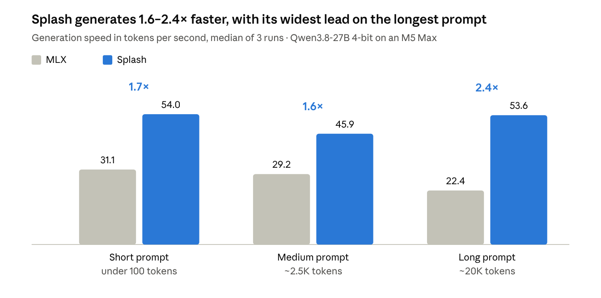
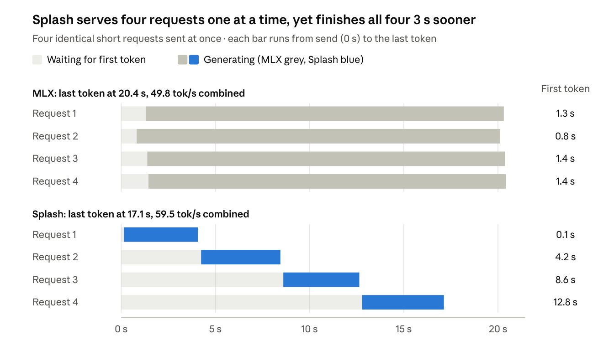

# Splash vs MLX on Apple Silicon

**Qwen3.8-27B (4-bit) on an M5 Max: Splash generates 1.6–2.4× faster than MLX,
processes a fresh long prompt at the same speed, and answers a repeated prompt
about 4× sooner — but it serves one request at a time.**



## Why I did this

LM Studio's Bionic app ships [Splash](https://huggingface.co/incoai/Qwen3.8-27B-Splash),
Inco AI's inference engine, as an experimental backend beside MLX. Splash is
built around one model at a time: custom kernels plus a bundled draft model
(DFlash 2) for speculative decoding. The promise is a big speedup, but only for
the handful of models it supports.

I wanted a straight answer before switching: on my own Mac, with the same
model, prompts and settings on both engines, how much faster is Splash really,
and where does the speed come from? This repo holds the benchmark, the raw
results, and everything needed to rerun it on your machine.

## Test machine

| Component | Details |
|---|---|
| Machine | MacBook Pro, Apple M5 Max |
| Memory | 128 GB unified memory |
| OS | macOS 27.0.1 |
| Host app | Bionic 1.1.7 (LM Studio), local server on port 1234 |
| MLX model | [`lmstudio-community/Qwen3.8-27B-MLX-4bit`](https://huggingface.co/lmstudio-community/Qwen3.8-27B-MLX-4bit) — 16.08 GB |
| Splash model | [`incoai/Qwen3.8-27B-Splash`](https://huggingface.co/incoai/Qwen3.8-27B-Splash) — 4-bit + draft model, 17.38 GB |
| Load settings | 40,960-token context for both; 4 parallel slots for MLX (Bionic exposes none for Splash) |
| Sampling | temperature 0, streaming |
| Run | 6 October 2026, MLX first then Splash, one model in memory at a time |

## Results

Medians of 3 runs per scenario. Per-run data is in [`results/`](results/).

| Measure | MLX | Splash | Splash vs MLX |
|---|---|---|---|
| Generation speed, short prompt | 31.1 tok/s | 54.0 tok/s | **1.7× faster** |
| Generation speed, ~2.5K-token prompt | 29.2 tok/s | 45.9 tok/s | **1.6× faster** |
| Generation speed, ~20K-token prompt | 22.4 tok/s | 53.6 tok/s | **2.4× faster** |
| First token, short prompt | 293 ms | 148 ms | 2.0× sooner |
| First token, fresh ~2.5K-token prompt | 3.71 s | 5.13 s | MLX 1.4× sooner |
| First token, fresh ~20K-token prompt | 36.0 s | 37.7 s | about the same |
| First token, repeated ~20K-token prompt | 715 ms | 182 ms | **3.9× sooner** |
| Prompt processing, ~20K tokens | 497 tok/s | 493 tok/s | the same |
| 4 simultaneous requests, combined speed | 49.8 tok/s | 59.5 tok/s | 1.2× faster |
| 4 simultaneous requests, longest wait for first token | 1.4 s | 12.8 s | MLX 8.8× sooner |

### What the numbers say

- **Generation is where Splash wins, and it holds up at long context.** MLX
  slows by 28% as the prompt grows from short to ~20K tokens; Splash stays
  between 46 and 54 tok/s.
- **A fresh long prompt costs the same on both.** Reading 20K tokens runs at
  about 500 tok/s on either engine, so the wait before the first word of a
  one-off long document doesn't change. On a fresh ~2.5K prompt MLX was faster.
- **Repeated prompts are where Splash shines.** When the same context is sent
  again, as agent loops do constantly, Splash starts answering in under 0.2 s
  versus about 0.7 s for MLX.
- **Splash streams in bursts.** MLX emits one token about every 32 ms. Most of
  Splash's tokens arrive together, then pause for roughly 65–80 ms: the draft
  model proposes a run of tokens, the main model checks them in one pass, and
  the accepted run is released at once. Speed × pause suggests about 3–4 tokens
  accepted per check (an estimate, not measured directly).

| Token gaps | MLX median | MLX 95th pct | Splash median | Splash 95th pct |
|---|---|---|---|---|
| Short prompt | 31.9 ms | 95.8 ms | 0.1 ms | 74.4 ms |
| ~2.5K-token prompt | 33.7 ms | 101.7 ms | 0.1 ms | 81.8 ms |
| ~20K-token prompt | 44.1 ms | 134.8 ms | 0.1 ms | 68.5 ms |

### Concurrency



MLX splits the GPU across all four requests, so each starts within 1.5 s and
streams at about 13 tok/s. Splash handled them one after another at about
61 tok/s each. For a single user Splash is faster overall; with several users
or parallel agents, later requests wait.

## Caveats

- **Different output types.** MLX spent every run's token budget on reasoning
  (thinking) text, while Splash answered directly on short, medium and
  simultaneous prompts. On the ~20K prompt both produced only reasoning, which
  makes it the cleanest like-for-like case, and Splash's lead is largest there.
  Bionic likely applies different thinking defaults per engine.
- **Different 4-bit packages.** The MLX and Splash conversions are not
  byte-identical. Speed comparisons hold; output quality was not measured.
- **Engine vs engine, not kernel vs kernel.** Speculative decoding ships inside
  the Splash package; MLX ran plain one-token-at-a-time decoding.
- **One prompt topic.** Speculative decoding speed depends on how often the
  draft model guesses right, which varies with the text. Code, other languages
  or creative writing may land differently.
- **One run order.** MLX ran first. `python3 run_bench.py --reverse` rules out
  thermal drift.
- **Memory not measured.** The script samples Bionic's server process
  (0.2–0.3 GB), not the process that holds the model.
- **Match load settings.** An earlier quick test loaded MLX with a
  262,144-token context and Splash with 40,960. It showed a misleading 7.5× gap
  on long prompts; with both at 40,960 the gap is 2.4×.

## How it was measured

Each engine is loaded fresh with nothing else in memory, then runs the same
four scenarios with identical prompts. The prompt asks the model to explain
speculative decoding in under 300 words, preceded by random filler text for the
medium and long cases.

| Scenario | Prompt size | Max output | Runs |
|---|---|---|---|
| Short | under 100 tokens | 300 tokens | 3 |
| Medium | ~2.5K tokens (labelled ~4K in the code) | 300 tokens | 3 |
| Long | 19,984 tokens on MLX, 19,942 on Splash (labelled ~32K in the code) | 256 tokens | 3 |
| Concurrent | 4 short requests sent at once | 256 tokens each | 1 batch |

| Metric | Definition |
|---|---|
| First token (TTFT) | Request sent → first streamed token, counting reasoning tokens |
| Generation speed | Output tokens ÷ time between the first and last token |
| Prompt processing | Prompt tokens ÷ time of a one-token, non-streaming request on an unseen long prompt |
| Token gaps | Median and 95th-percentile time between consecutive streamed tokens |

- Every scenario starts with a warmup request using different filler text, so
  the first measured run is never already cached.
- Runs 2 and 3 resend run 1's exact prompt, so they measure prompt-cache reuse;
  run 1 is the cold case.

## Run it yourself

Requirements: Apple M3 or newer, macOS 26.4+, at least 36 GB of unified memory
(Splash's minimum), and Python 3.9+ (the scripts use only the standard library).

### Through Bionic (how these results were made)

Install Bionic, download both models in the app, and put its `lms` CLI on your
PATH:

```bash
git clone https://github.com/jayozer/splash-vs-mlx-bench && cd splash-vs-mlx-bench
export PATH="$HOME/.lmstudio/bin:$PATH"
python3 run_bench.py
```

The script prints your machine info, starts Bionic's local server if needed,
unloads every model, then loads each engine fresh and runs the suite. It writes
`results/bionic-*.jsonl`, `results/bionic-*.md` and `results/comparison.md`.

| Option | What it does |
|---|---|
| `--quick` | Smoke test: one run per scenario, no concurrency test (~2 min) |
| `--reverse` | Runs Splash first, to check for thermal drift |
| `--mlx KEY` / `--splash KEY` | Override model auto-detection (keys from `lms ls`) |
| `CONTEXT=8192 PARALLEL=1` | Environment overrides for smaller Macs |

### With standalone servers

Runs each engine's own server instead of Bionic. Run one engine at a time:

```bash
brew install uv && uv tool install mlx-lm
brew install incoai/tap/splash
./run_engine.sh mlx      # mlx_lm.server on port 8080, downloads ~17 GB on first run
./run_engine.sh splash   # splash serve on port 8000, downloads 17.4 GB on first run
```

To benchmark a server that is already running, call `benchmark.py` directly:

```bash
python3 benchmark.py --base-url http://127.0.0.1:8080/v1 \
  --model mlx-community/Qwen3.8-27B-4bit --engine-name MLX \
  --out results/mlx.jsonl
```

## Repository layout

| Path | What it is |
|---|---|
| `run_bench.py` | Main harness through Bionic: loads each model fresh, runs the suite, writes results and the comparison |
| `benchmark.py` | The suite against any OpenAI-compatible server |
| `run_engine.sh` | Starts a standalone `mlx_lm.server` or `splash serve`, then runs `benchmark.py` |
| `run_bionic.sh` | Shell version of the Bionic flow using `lms` and `benchmark.py` |
| `results/bionic-mlx.*`, `results/bionic-splash.*` | The full run reported above (6 October 2026) |
| `results/comparison.md` | Side-by-side table from that run |
| `results/bionic-mlx4.*` | An earlier exploratory MLX run through `benchmark.py` (5 October 2026) |
| `assets/` | Charts used in this README |

## Troubleshooting

- **`lms: command not found`**: add `~/.lmstudio/bin` to your PATH.
- **`mlx_lm: command not found`**: run `uv tool install mlx-lm`, then check
  that `~/.local/bin` is on your PATH.
- **Splash readiness times out**: the first run downloads 17.4 GB and tunes to
  your machine; raise the wait with `READY_TIMEOUT=3600 ./run_engine.sh splash`
  and check `results/splash-server.log`.
- **Port already in use**: stop the other engine, or Bionic's local server if
  it holds port 8000 or 8080.
